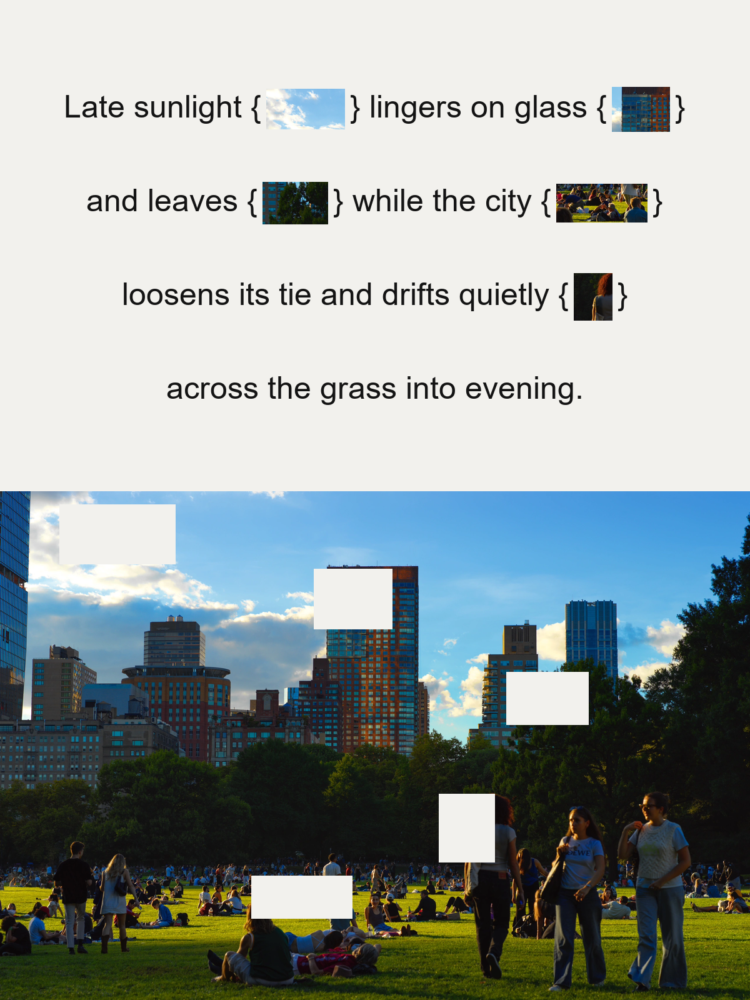
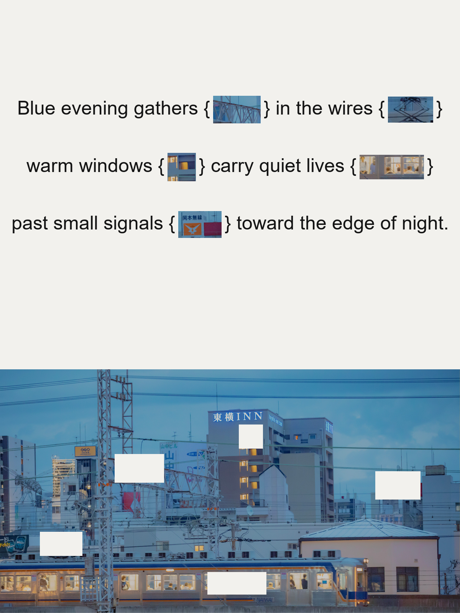

# Visual Token Editorial

**English** · [简体中文](README.zh-CN.md)

A Codex Skill that turns one photograph into a restrained piece of editorial visual poetry. Exact fragments from the source image become semantic tokens inside a sentence, while the same regions are removed from the photograph below as quiet, precisely matched absences.

Invoke it as `visual-token-editorial`.

## Visual Direction

Each composition is arranged as a portrait editorial page with generous warm off-white space above the source photograph. Its visual language includes:

- 4–7 compact, recognizable fragments selected from one photograph
- Image fragments embedded directly into the sentence as semantic words
- One consistent half-width wrapper style per composition: `()` or `{}`
- Neutral sans-serif typography with compact leading
- Larger inline image tokens and copy constrained to no more than four balanced lines
- A complete upper text-and-image framework centered in the white region
- Solid masks in the lower photograph that correspond exactly to the extracted fragments
- At least 2.5% breathing room between every mask and all four photograph edges
- Raw rectangular crops without cards, rounded corners, borders, shadows, or UI styling
- A quiet, modern editorial mood rather than an advertising or scrapbook layout

The core relationship is:

```text
Extract → Reference → Remove
```

The crop is not decoration. It carries meaning in the sentence and points back to its exact origin in the photograph.

## Examples

| Late Light, Open City | Signals at Blue Hour |
| --- | --- |
|  |  |

## Before Generation

Before editing the image, the Skill resolves three choices and asks only for anything the user has not already specified:

1. Whether the source should be cropped
2. Whether the copy is user-provided or automatically generated
3. Which language the copy should use

When a very tall or awkward source would create an excessively long poster or weak composition, the Skill recommends a specific landscape crop and explains what it preserves. Cropping happens only after approval. The original remains unchanged, while one deterministic working crop is locked before copywriting and token selection. All token coordinates, masks, resizing, and pixel QA then use that working crop as their source baseline.

## How It Works

The Skill supports two copy modes:

1. **User-provided copy** — preserves the original wording, punctuation, order, and language, then selects 4–7 visual fragments that correspond to its concrete nouns, images, or phrases.
2. **Automatic copy** — writes restrained poetic copy in English by default, or in another language explicitly requested by the user.

The final composition is rendered deterministically with Pillow. The lower image is limited to EXIF correction, proportional resizing, and the declared solid rectangular masks. No inpainting, generative replacement, retouching, or color grading is used.

## Install

Ask Codex to install the Skill:

```text
Install the visual-token-editorial skill from
https://github.com/htquan1228/visual-token-editorial
```

Or clone the public repository directly into your Codex skills directory:

```bash
git clone https://github.com/htquan1228/visual-token-editorial.git \
  ~/.codex/skills/visual-token-editorial
```

If the Skill does not appear immediately, restart Codex.

## Usage

Attach one photograph and invoke the Skill:

```text
Use $visual-token-editorial to turn this photograph into an editorial visual-poetry poster.
```

Provide your own copy when you want the image fragments to respond to a specific sentence:

```text
Use $visual-token-editorial with this copy:
"The last light crosses the windows while the street keeps moving."
```

You can also request another language without supplying copy:

```text
Use $visual-token-editorial and write the copy in Chinese.
```

For a tall source, ask the Skill to propose the framing before generation:

```text
Use $visual-token-editorial. If this image is too tall, first propose a suitable landscape crop. Generate the copy automatically in Italian.
```

## Output

Each completed composition includes:

1. `final.png` — the finished deterministic poster
2. `composition.yaml` — the editable source of truth for copy, layout, tokens, and normalized crop coordinates
3. `qa_report.md` — pixel-integrity and alignment checks

The QA report verifies:

- Exact token-to-mask bbox correspondence
- Zero changed pixels outside the declared masks
- Solid mask interiors
- One wrapper family across the composition
- Wrapper/text baseline equality
- Token/wrapper centerline alignment within 1 px
- Horizontal and vertical centering of the complete upper framework within 1 px

## Requirements

- Python 3.10 or later
- Pillow

`composition.yaml` uses JSON-compatible YAML, so PyYAML is not required.

## Repository Structure

- `SKILL.md` — Codex Skill entrypoint and non-negotiable rules
- `agents/openai.yaml` — Codex UI metadata
- `references/visual-system.md` — crop, copy, typography, and image-integrity guidance
- `references/composition-schema.md` — reproducible composition format
- `scripts/validate_composition.py` — structural and layout validator
- `scripts/render_composition.py` — deterministic Pillow renderer
- `examples/` — selected finished compositions
- `README.md` — English overview and installation guide
- `README.zh-CN.md` — Simplified Chinese overview and installation guide

This repository publishes one standalone Codex Skill.

## License

No open-source license is currently included. Public visibility does not grant permission to redistribute or modify the code beyond rights provided by applicable law.
